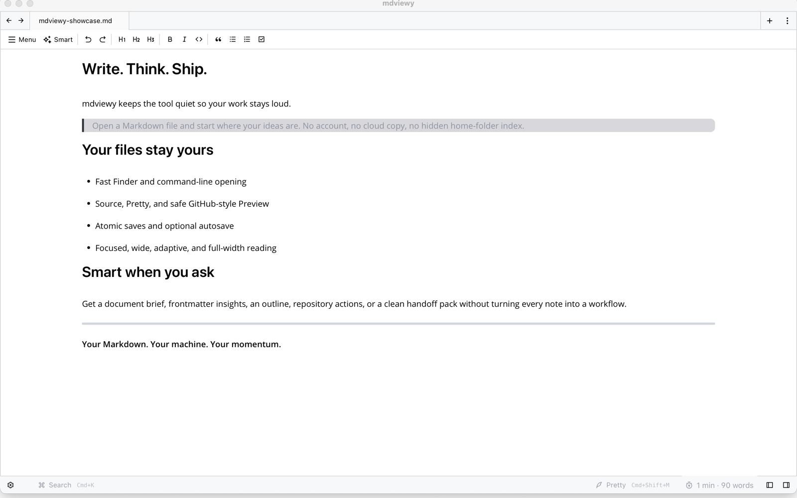

<p align="center">
  
</p>

<h1 align="center">mdviewy</h1>

<p align="center">
  <strong>Your Markdown. Your files. Your flow.</strong><br>
  A calm, fast, local-first Markdown workspace for macOS, Windows, and Linux.
</p>

<p align="center">
  <a href="https://github.com/Supersynergy/mdviewy/releases/tag/v0.92.0"></a>
  <a href="https://github.com/Supersynergy/mdviewy/actions/workflows/ci.yml"></a>
  <a href="LICENSE"></a>
</p>



## Markdown without the machinery

Open a file and read. Open a folder when you want a workspace. mdviewy does not ask for an account, copy your notes into a database, or index home folders behind your back.

- **Instant focus:** files opened from Finder, Explorer, the CLI, or the app collapse surrounding panels and use the available reading space.
- **Your format stays yours:** ordinary Markdown files on disk, with source, WYSIWYG, and safe preview modes.
- **Smart when invited:** document briefs, frontmatter insights, path and repository actions, optional AI providers, and agent-ready context packs.
- **Native and calm:** Tauri desktop shell, adaptive document widths, keyboard-first navigation, and no browser tab clutter.

## What is included

| Area | Capabilities |
| --- | --- |
| Reading | GitHub-style README preview, sanitized HTML, GFM tables, tasks and alerts, relative assets, math, Mermaid diagrams, responsive media |
| Writing | Source and WYSIWYG editing, tabs, spellcheck, typewriter scroll, frontmatter, autosave, atomic file replacement |
| Navigation | File tree, quick open, full-text search, command palette, outline, bookmarks, recent files |
| Smart Actions | Metadata and word insights, deterministic document brief, local-path actions, GitHub repository detection, agent-ready handoff packs |
| Export | HTML, image, Print / Save as PDF |
| Personalization | Light/dark themes, custom themes, shortcuts, focused/wide/full content widths, multilingual UI |
| Safety | No automatic home-folder indexing, bounded workspace scans, recoverable UI errors, CSP, sanitized README HTML |

README files open in the dedicated preview automatically. If a document contains GitHub-only syntax that the visual editor cannot round-trip safely, mdviewy opens Source mode instead of silently changing the file.

## Download 0.92.0

Choose your platform on the [v0.92.0 release page](https://github.com/Supersynergy/mdviewy/releases/tag/v0.92.0).

| Platform | Recommended package |
| --- | --- |
| macOS Apple Silicon | `aarch64.dmg` |
| macOS Intel | `x64.dmg` |
| Windows 11 | `x64-setup.exe` |
| Windows managed install | `.msi` |
| Windows without WebView2 | `mdviewy_offline_*_x64-setup.exe` |
| Linux | `.AppImage`, `.deb`, or `.rpm` |

The 0.92 binaries are public prerelease builds. macOS notarization and Windows code signing are not configured yet, so the operating system may show a first-launch warning. Download only from this repository.

If macOS quarantines the app after you verify the download, use:

```bash
xattr -cr /Applications/mdviewy.app
```

## Build from source

Requirements: Node.js 26, Corepack/Yarn 4, current stable Rust, and the [Tauri system dependencies](https://v2.tauri.app/start/prerequisites/) for your OS.

```bash
git clone https://github.com/Supersynergy/mdviewy.git
cd mdviewy
corepack enable
yarn install --immutable
yarn setup
yarn dev:desktop
```

Production build:

```bash
yarn build:desktop
```

## Privacy and security

Your documents remain local unless you explicitly configure and call an external AI provider. Provider keys are stored in the local app settings; do not sync that settings file. See [SECURITY.md](SECURITY.md) for supported versions, the security posture, and private reporting.

## Project status

0.92 focuses on trustworthy file opening, atomic saves, GitHub README fidelity, clean startup, and recovery from renderer failures. The remaining 1.0 gates are tracked in [the roadmap](docs/ROADMAP-1.0.md), including signed/notarized releases, external-edit conflict handling, and end-to-end platform tests.

Issues and focused pull requests are welcome. Start with [CONTRIBUTING.md](CONTRIBUTING.md), use the [issue tracker](https://github.com/Supersynergy/mdviewy/issues), and keep user files and privacy as the first constraint.

## Provenance

mdviewy began as a fork of [MarkFlowy](https://github.com/drl990114/MarkFlowy) and is now independently maintained with a local-first product direction.

## License

[AGPL-3.0-only](LICENSE)
