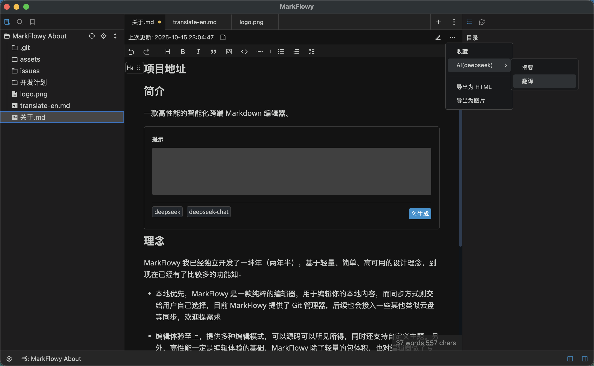

<!-- This file was automatically generated by Nanolaba Readme Generator (NRG) 1.1 -->
<!-- Visit https://github.com/nanolaba/readme-generator for details -->

  

<h2 align="center"/>mdmaster <em>beta</em></h2>

 
<em>现代化与智能化的 Markdown 编辑器。</em>
 
 

[![App Version][version-badge]][release]
[![Downloads][downloads-badge]][release]
 
[![Build Status][build-badge]][build]
[![Code of Conduct][coc-badge]][coc]
[![Commit Activity][commit-badge]][commit]
[![issues-closed]](https://github.com/Supersynergy/mdviewy/issues?q=sort%3Aupdated-desc+is%3Aissue+is%3Aclosed)
 
[![PRs Welcome][prs-welcome-badge]][prs-welcome]
[![TypeScript-version-icon]](https://www.typescriptlang.org/)
[![Rust-version-icon]](https://www.rust-lang.org/)
[![License][license-badge]][license]
[![codefactor]](https://www.codefactor.io/repository/github/Supersynergy/mdviewy)

 

<h4 align="center"> <a href="https://github.com/Supersynergy/mdviewy">English</a> | <strong>简体中文</strong> | <a href="./README_JA.md">日本語</a></h4>

## mdmaster 目前处于 Beta 阶段 ⚠️

目前 mdmaster 处于 beta 阶段，建议在有数据备份的情况下使用。

## 功能特性

- **内置 AI**：当前支持Copilot、一键导出对话、翻译文章到任何语言以及获取文章摘要，支持`DeepSeek`、`Chatgpt`等大模型让他们成为你的智能助手。
- **超轻量**：mdmaster 基于 tauri, 拥有小于 20MB 的体积和更好的性能。
- **多编辑模式**：mdmaster 使用 prosemirror 作为编辑器核心, 不仅扩展性高，编辑体验也很好。并支持多种编辑模式，如`source code`, `wysiwyg`。
- **编辑多种文件**：除了 Markdown，还支持编辑 `json`、`txt` 等文件类型。
- **自定义主题**：支持自定义主题，并且你也可以与他人分享你的主题。
- **自定义快捷键**：支持自定义快捷键，满足个性化需求。
- **图片处理**：当你粘贴图片到 mdmaster，可以选择粘贴到指定的路径，或者转为 `base64`。
- **文件管理**：功能强大的文件树，支持拖拽移动、全局搜索等常用功能。
- **多语言支持**：支持中文、英文、西班牙语、日语、法语等多种语言。

## 下载

支持平台 Linux, macOS 和 Windows.

> [!NOTE]
> 因为苹果安全策略对于没有开发者认证软件的限制，导致 **macOS aarch64** 版本无法直接安装. 你可以通过一下步骤忽略该限制:
> - 打开终端
> - 进入到 `应用` 的目录下. 例如 `/Applications`.
> - 执行 `xattr -cr mdmaster.app` 然后打开 app 即可
> - 请确保下载来源: `github releases` 或 [UpgradeLink](https://download.upgrade.toolsetlink.com/download?appKey=xpn68m4j5qU0Y1rfDYFHaA).

你可以通过 [UpgradeLink 下载页面](https://download.upgrade.toolsetlink.com/download?appKey=xpn68m4j5qU0Y1rfDYFHaA) 或 [GitHub Release](https://github.com/Supersynergy/mdviewy/releases) 下载.

## 为什么开发

其实，**创作 mdmaster 的最初灵感，源于几年前和一位朋友一次闲聊**，作为开发者，我们对一款理想 Markdown 编辑器有很多的期待。在尝试过许多现有应用后，我感到它们难以完全满足在高效、美观、轻量与工作流融合上的综合需求。我们共同畅想了一款理想中编辑器的模样。尽管后来我们各自奔赴不同的人生，联系渐少，但那颗渴望创造美好的种子，一直在我心里。

最初的念想，推动着我一步步将 mdmaster 从构想变为现实。我希望能打造一款轻量、智能的编辑器，让它不仅能安全可靠地处理内容，还能通过 AI 来提高编辑工作的效率。

mdmaster 是一个产品，也是一段人生旅程的见证。并在一路的学习与构建中，成长为我对**高效、智能、轻量**这些理念的回应，希望 mdmaster 能成为一个让大家感到趁手和愉悦的工具，也欢迎大家能来体验，并提出宝贵的意见。

## 参与

目前 mdmaster 仍处于初级阶段，可能会有一些不好的体验或bug。欢迎所有感兴趣或遇到使用问题的合作伙伴提交[issue](https://github.com/Supersynergy/mdviewy/issues/new)或[PR](https://github.com/Supersynergy/mdviewy/compare)参与这个项目。

### 如何贡献

您可以阅读 [CONTRIBUTING](./docs/en/Community/CONTRIBUTING.md) 来了解如何启动项目和修改代码，欢迎参与代码贡献。

## 支持

mdmaster 是完全永久开源的，如果你想支持 mdmaster，你可以`star`这个项目。特殊赞助可以通过 [邮箱](mailto:drl990114@gmail.com) 联系我。
<!-- 
另外你还可以通过微信或支付宝对我进行赞助，这会给我极大地鼓励。并且也会用于项目后续的发展，如服务器、域名等支出。

[赞助列表](https://drl990114.github.io/sponsor)

| 微信赞助 | 支付宝赞助 |
| :-: | :-: |
|   <small>来瓶酒~</small> |   <small>来杯咖啡~</small> | -->

## 赞助商

感谢 [UpgradeLink](https://www.toolsetlink.com) 提供可靠的安装与升级服务，确保 mdmaster 用户获得无缝的软件更新体验。

## 特别感谢

- [rino](https://github.com/ocavue/rino) by [ocavue](https://github.com/ocavue) - 感谢 ocavue 开发的 rino，当前项目 editor 的初版基于此构建。
- [remirror](https://remirror.io/) - 一个强大的基于 ProseMirror 的富文本编辑器框架。
- [tauri](https://tauri.app/) - 使用 Web 前端构建更小、更快、更安全的桌面应用。
- 感谢所有 mdmaster 依赖的库和开源项目。

<!-- badges -->
[build-badge]: https://img.shields.io/github/actions/workflow/status/Supersynergy/mdviewy/nodejs.yml.svg?style=flat-square&labelColor=black
[build]: https://github.com/Supersynergy/mdviewy/actions/workflows/nodejs.yml?labelColor=black
[downloads-badge]:  https://img.shields.io/github/downloads/Supersynergy/mdviewy/total?label=downloads&style=flat-square&labelColor=black
[license-badge]: https://img.shields.io/badge/license-AGPL-purple.svg?style=flat-square&labelColor=black
[license]: https://opensource.org/licenses/AGPL-3.0?labelColor=black
[release]: https://github.com/Supersynergy/mdviewy/releases?labelColor=black
[prs-welcome-badge]: https://img.shields.io/badge/PRs-welcome-brightgreen.svg?style=flat-square&labelColor=black&color=%23dd5c13
[prs-welcome]: https://github.com/Supersynergy/mdviewy/blob/main/CONTRIBUTING.md?labelColor=black
[coc-badge]: https://img.shields.io/badge/code%20of-conduct-ff69b4.svg?style=flat-square&labelColor=black
[coc]: https://github.com/Supersynergy/mdviewy/blob/main/CODE_OF_CONDUCT.md?labelColor=black
[commit-badge]: https://img.shields.io/github/commit-activity/m/Supersynergy/mdviewy?color=%23ff9900&style=flat-square&labelColor=black
[commit]: https://github.com/Supersynergy/mdviewy?labelColor=black
[version-badge]: https://img.shields.io/github/v/release/Supersynergy/mdviewy?color=%239accfe&label=version&style=flat-square&labelColor=black
[rust-version-icon]: https://img.shields.io/badge/Rust-1.85.0-dea584?style=flat-square&labelColor=black
[typescript-version-icon]: https://img.shields.io/github/package-json/dependency-version/Supersynergy/mdviewy/dev/typescript?label=TypeScript&style=flat-square&labelColor=black
[issues-closed]: https://img.shields.io/github/issues-closed/Supersynergy/mdviewy.svg?style=flat-square&labelColor=black
[codefactor]: https://www.codefactor.io/repository/github/Supersynergy/mdviewy/badge/main?style=flat-square&labelColor=black

## License

